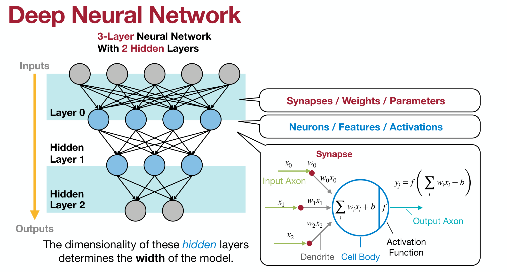
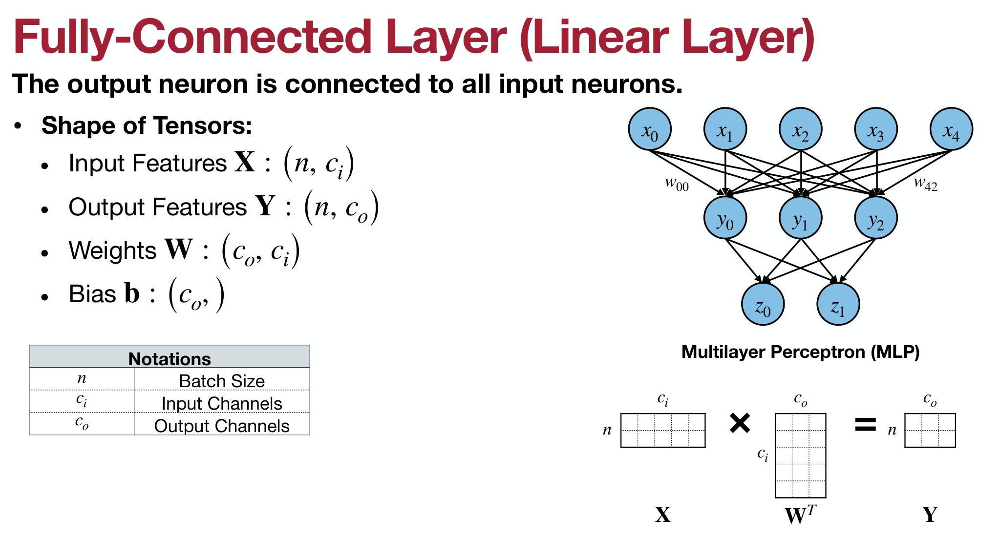

# 第2章 Basics of Deep Learning 

[EfficientViT](https://arxiv.org/abs/2205.14756)
&emsp;&emsp;一个提升高分辨率计算机视觉AI模型，可以提升视频流中的图片质量或帮助自动驾驶汽车识别道路危险，该系统是足够快的且可以运行在移动或云设备上。

&emsp;&emsp;隐藏层的维度决定了模型的宽度（width）。要解决比较复杂的问题， 要么增加深度， 要么增加宽度， 而增加宽度的代价往往远高于深度。 模型深度带来的好处：
- 强大的表达能力。具有更好的非线性表达能力，可以学习更加负责的变化，从而拟合更加负责的输入。
- 逐层的特征学习。每层都各司其职，要做的事情也更加简单，更深的网络层能学习到更复杂的表达。

&emsp;&emsp;宽度，即通道的数量，深度在一定程度上能够表现出更好的性能, 而宽度则起到另一个作用。那就是让每一层学习到更加丰富的特征, 比如不同方向, 不同频率的纹理特征。 比如颜色的地区, 以及颜色变化的情况等。太窄的网络, 每一层能捕获的模式有限, 此时网络再深都不可能提取到足够的信息往下传递。

## 参考文献

- [深度学习的深度和宽度的理解](https://javaforall.cn/143681.html)